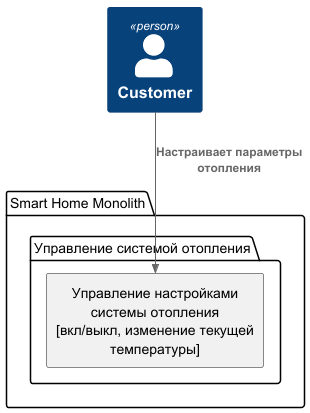
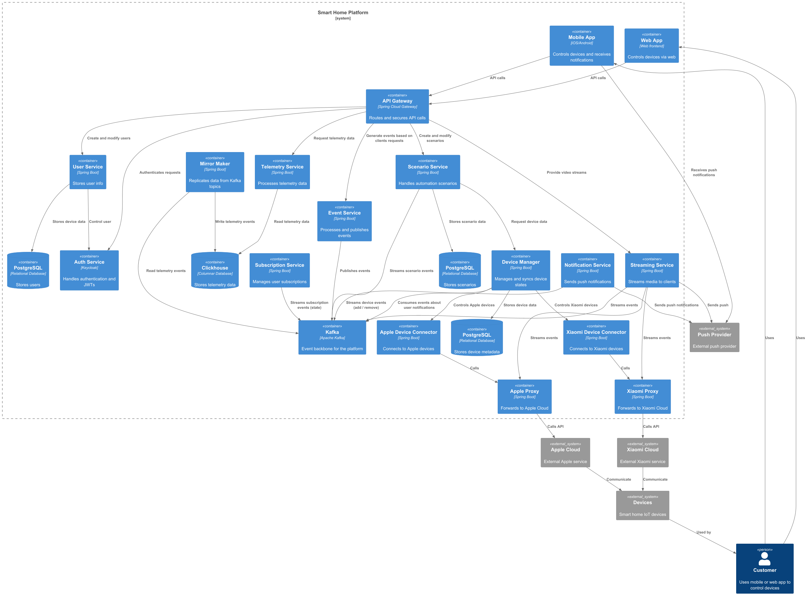
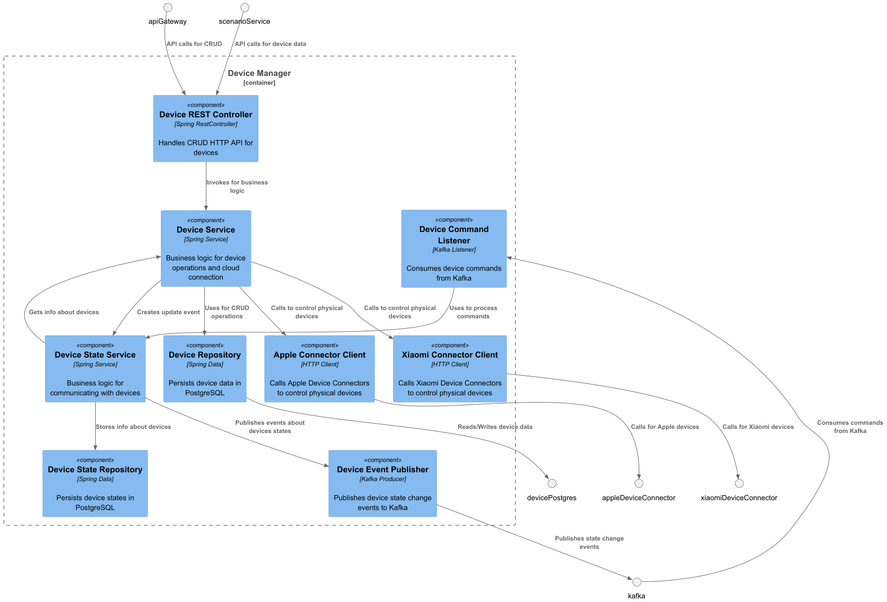
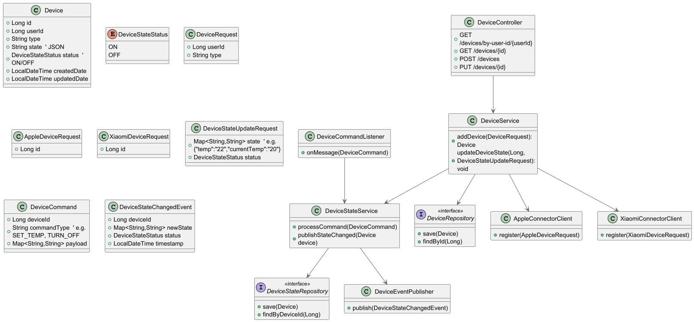
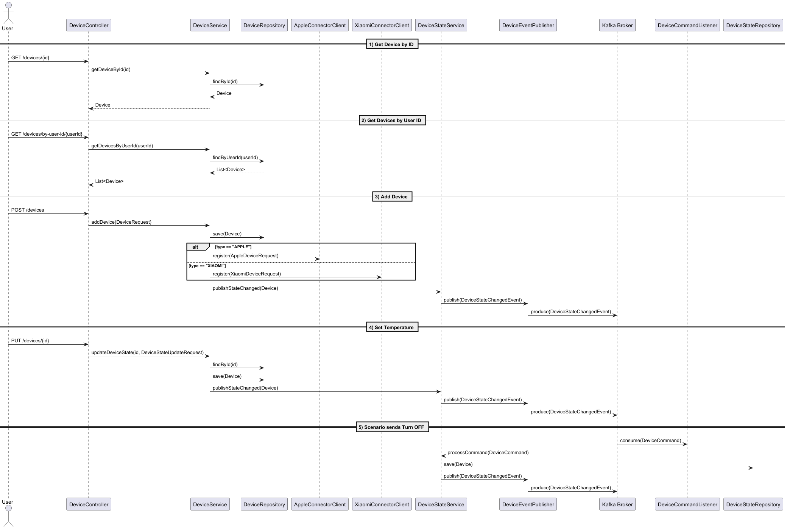

# Project_template

Это шаблон для решения проектной работы. Структура этого файла повторяет структуру заданий. Заполняйте его по мере работы над решением.

# Задание 1. Анализ и планирование

<aside>
💡

Чтобы составить документ с описанием текущей архитектуры приложения, можно часть информации взять из описания компани и условия задания. Это нормально.

</aside>

### 1. Описание функциональности монолитного приложения

**Управление отоплением:**

- Пользователи могут:
  - включать / выключать систему отопления
- Система поддерживает:
  - включать / отключать существующие системы отопления

**Мониторинг температуры:**

- Пользователи могут:
  - задавать требуемую температуру нагрева
  - получать текущую температуру нагрева
- Система поддерживает:
  - регулировать требуемую температуру
  - отдавать сведения о текущей температуре, заданной температуре, состояние системы (вкл / выкл)


### 2. Анализ архитектуры монолитного приложения

Перечислите здесь основные особенности текущего приложения: какой язык программирования используется, какая база данных, как организовано взаимодействие между компонентами и так далее.

- java 17
- spring boot 3.3.2
- система сборки maven
- БД - postgres, с ручной миграцией

Типичная структура spring проекта, разбитая по слоям: 
```
Контроллер (HeatingSystemController) -> Сервис (HeatingSystemServiceImpl) -> Репозиторий (HeatingSystemRepository) -> БД
```
для интеграционных тестов используются тестконтейнеры

### 3. Определение доменов и границы контекстов

Опишите здесь домены, которые вы выделили.

Домен: Управление системой отопления
  поддомены:
  -  Управление настройками системы отопления

Контекст управления системой отопления
  - Heating system - система отопления
  - Temperature sensor - датчик температуры

### **4. Проблемы монолитного решения**

- одна кодовая база для разных доменов
- невозможность масштабирования конкретной части приложения
- общая БД

### 5. Визуализация контекста системы — диаграмма С4

Добавьте сюда диаграмму контекста в модели C4.



# Задание 2. Проектирование микросервисной архитектуры

В этом задании вам нужно предоставить только диаграммы в модели C4. Мы не просим вас отдельно описывать получившиеся микросервисы и то, как вы определили взаимодействия между компонентами To-Be системы. Если вы правильно подготовите диаграммы C4, они и так это покажут.

**Диаграмма контейнеров (Containers)**



**Диаграмма компонентов (Components)**



**Диаграмма кода (Code)**



**Диаграмма вызовов (Code)**



# Задание 3. Разработка ER-диаграммы

Добавьте сюда ER-диаграмму. Она должна отражать ключевые сущности системы, их атрибуты и тип связей между ними.

Четвёртое задание — дополнительное. Его можно сделать по желанию. Чтобы ревьюер быстрее проверил ваше решение, укажите, сделали вы это задание или нет. Для этого оставьте нужный эмодзи около заголовка задания:

✅ — вы выполнили задание.

❌ — вы пропустили задание.

# ✅ ❌ Задание 4. Создание и документирование API

### 1. Тип API

Укажите, какой тип API вы будете использовать для взаимодействия микросервисов. Объясните своё решение.

### 2. Документация API

Здесь приложите ссылки на документацию API для микросервисов, которые вы спроектировали в первой части проектной работы. Для документирования используйте Swagger/OpenAPI или AsyncAPI.